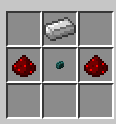

# Code Lock

CodeLock is a Minecraft plugin (and my first plugin made ever!). It allows players to lock various entities with a code lock. Inspired by Rust (game), the code can only be entered once and then never again. This makes it easier to lock things without having to worry about entering the code every time.

## Motivation

I had just created my first Minecraft server on a Raspberry Pi 4B using Spigot and wanted to add a plugin that would lock things with a code lock. However, I found it annoying and redundant to enter the code every time, which discouraged the use of the code lock on things I would frequently use. Since I am a huge Rust player, I wanted something similar to their code lock. Thus, CodeLock was born! In fact, this plugin was intentionally designed to work just like it would in Rust.

## Notice for server owners

This plugin was mostly developped around a personnal need and I later decided it could be interesting to other server owners. However, **at the moment**, the plugin is given as-is and there is little to no configuration possible. Configuration is in the TODO list, but that does not mean it will ever be implemented. That being said, the project is open to contribution to implement these mechanisms, should that interest you.

## Installation

Right now, the plugin is in testing phase for an initial release. Until then, see the `Development` section below to see how to build the archive and install it to your server. When it releases, it will be available like a standard Spigot plugin with the jar already built.

## Pre-requisites

Code Lock was developped on `Spigot 1.16.5` API, so versions below or above 1.16 could potentially not be compatible.

## Features

Here are the key features of the plugin, other than just "locking" stuff!

### Craftable

The lock has a custom crafting recipe that allows everyone to craft them, providing they have the ressources. Use the following recipe to craft it.

_Any button can be used in the middle!_

### Enter and forget

Enter the code once when setting the lock and never do it again! The lock will still lock other players who did not enter the code, but you won't even notice it is there. The only time you'll have to re-enter the code is if it changes.

### Player damage protection

Locked entites automatically have protection against _direct_ damage from unauthorized players. This means that fire and explosions will still destroy the entity.

_Note: although the entity itself is protected, any other blocks around it are not. This means that a locked door can be bypassed by simply breaking another block to get through (or even break the block under the door!). That said, a grief plugin should be used in conjunction with this plugin!_

### Guest codes (Not yet available)

Set another code that can be given to your friends so they can have access to the entity. However, guests may not change, unlock or remove the code lock. At any time, the guest code can be removed.

## Usage

Use the `/codelock usage` command to learn about the different ways you can use the code lock.

It is also worth mentionning that the only way to change a lock code is to unlock it first (just like in Rust). Keep this in mind, as this could allow sneaky players to change the code before you!

## Development

If you wish to work on this plugin, you can follow the steps below. Note that the plugin was tested on a Spigot server, but from what I learned from the forums, Spigot is built on the Bukkit API which is also used by other kind of servers like Paper. That said, the plugin should technically work on any Bukkit server, but feel free to correct me if I'm wrong as I do not have much experience with Minecraft plugin development.

1. Clone the repo
2. Do some modifications
3. Run the "package" command (Maven) to build the plugin's jar
4. Place the resulting jar in the `plugins` folder on your Spigot server

## Contributing

See [CONTRIBUTING](CONTRIBUTING.md)

## TODO

Here's a list of things I wish to add in the future. They may or may not be implemented, but would reinforce the plugin's accessibility and be more appealing to other server owners.

### Permissions

Currently, obvious commands such as `save`, `load` and `cleardata` are hardcoded to work for OPs (and server) only. All other commands are available for everyone.

Permissions could also be useful to allow OPs (or other groups) to override a lock at any time. However, if I'm an OP and I actively play on my server, I do not want to just open locked doors without even realizing there was a code lock. Sure, this could (and probably should) be an option, but I'd still want to be "locked out" from other players so I can ethically play like others. A button on the GUI that would only be available to OPs is being considered and would allow an OP to authorize himself on the code lock rather than just magically opening everything.

### Guest codes

As explained above, guest codes allow limited access to the locked entity. This means that the guest cannot control the locked state of the lock, which indirectly means they also can't change the code.

### Configuration

As stated multiple times, the whole plugin is designed around Rust's code lock. The first goal of the plugin development was to replicate it. Now that it has been done, it could be interesting for the users to tweak some of this "design". Simple examples of this would be to set a custom code length other than 4 or use the `LockedBlock.BLOCKTYPE_WHITELIST` (which has nothing in at the moment) and whitelist block types which can't be locked normally.

### Code Lock Cracker

This is just an idea off the top of my head and is more of a COULD rather than a SHOULD. An item which would be significantly costly to make but would allow players to place the cracker on a locked entity, wait a minute or two and break the code lock.

### Code Lock material on remove

This is a rather small detail, but right now the `Material` of the button given when removing a lock is always `OAK_BUTTON` because it uses the default constructor. The `GUIClickEvent` responsible for removing the lock has no way of knowing which `Material` was on the code lock prior to its placement. The solution would be to add a new field to the `LockedBlock` which would persist this kind of information and then we could get it from the `GUIClickEvent`. I've already written two commented lines in `CodeLockItem` that would persist the `Material` type in the `ItemStack` (inside its metadata). This information could be used when placing the code lock and creating the `LockedBlock`. However, I did not want to modify the `LockedBlock` data model just yet.
